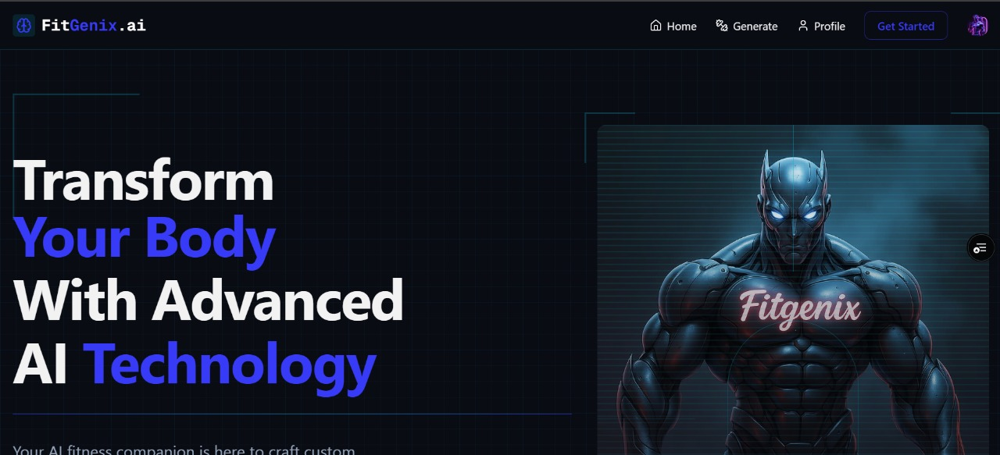
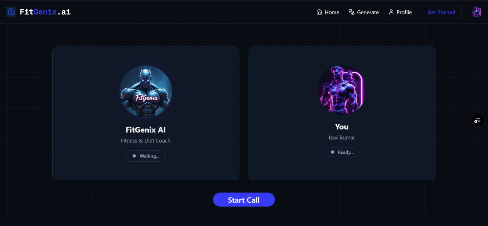
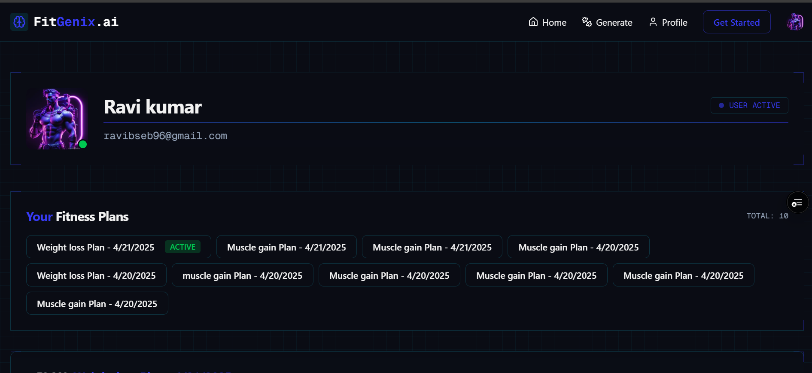

# 💪 FitGenix — AI-Powered Fitness Companion

FitGenix is a smart virtual fitness coach that provides personalized workout and diet recommendations using AI. It combines modern technologies to deliver a seamless and interactive fitness experience — including voice interaction, real-time updates, and a clean, responsive UI.

---

## 🚀 Features

- 🧠 **AI-Powered Recommendations**  
  Get customized workout and diet plans generated by **Gemini AI** based on your goals.

- 🗣️ **Voice Assistant Integration**  
  Use **Vapi** to interact with your AI fitness coach through voice commands.

- 🔐 **Authentication**  
  User sign-up and sign-in handled securely with **Clerk**.

- 🗄️ **Real-Time Database**  
  User data and plan management with **Convex** for real-time responsiveness.

- 📬 **Webhooks**  
  Smooth backend communication using **Svix Webhooks**.

- ⚙️ **Modern Frontend Stack**  
  Built with **Next.js**, **TypeScript**, and **Tailwind CSS** for speed, scalability, and a beautiful user interface.

---

## 🧱 Tech Stack

| Technology       | Purpose                                  |
| ---------------- | ---------------------------------------- |
| **Next.js**      | React framework for frontend and routing |
| **TypeScript**   | Type-safe JavaScript                     |
| **Tailwind CSS** | Styling and responsive UI design         |
| **Gemini AI**    | Smart recommendation engine              |
| **Vapi**         | Voice assistant integration              |
| **Clerk**        | User authentication                      |
| **Convex**       | Real-time database                       |
| **Svix**         | Webhook handling for backend sync        |

---

## 📸 Screenshots







---

## 🔗 Live Demo

👉 [Visit FitGenix on Vercel](https://fit-genix-ai.vercel.app/)

---

## 🛠️ Getting Started

### 1. Clone the repository

```bash
git clone https://github.com/developer-ravi-03/Ai-fitness-coach.git

cd Ai-fitness-coach
```

### 2. Install dependencies

```bash
npm install
```

### 3. Configure Environment Variables

Create a .env.local file in the root directory and add necessary API keys for:

```bash
NEXT_PUBLIC_CONVEX_URL=
CONVEX_DEPLOYMENT=
NEXT_PUBLIC_VAPI_API_KEY=
NEXT_PUBLIC_VAPI_WORKFLOW_ID=
NEXT_PUBLIC_CLERK_SIGN_UP_URL=
NEXT_PUBLIC_CLERK_SIGN_IN_URL=
CLERK_SECRET_KEY=
NEXT_PUBLIC_CLERK_PUBLISHABLE_KEY=
```

### 4. Run the backend server

```bash
npx convex dev
```

### 5. Run the server

```bash
npm run dev
```

Open [http://localhost:3000](http://localhost:3000) with your browser to see the result.

# 👋 Connect with Me

- 🔗 **LinkedIn** - [ItzRavi](https://www.linkedin.com/in/itzravi/)
- 🌐 **Portfolio** - [Ravi Kumar](https://portfolio-website-next-hazel.vercel.app/)
